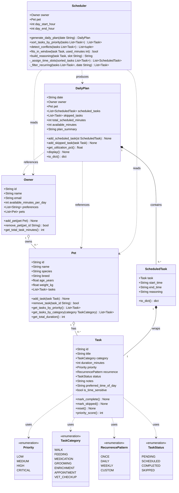

```mermaid
classDiagram

    %% ── Enumerations ──────────────────────────────────────────────

    class Priority {
        <<enumeration>>
        LOW
        MEDIUM
        HIGH
        CRITICAL
    }

    class TaskCategory {
        <<enumeration>>
        WALK
        FEEDING
        MEDICATION
        GROOMING
        ENRICHMENT
        APPOINTMENT
        VET_CHECKUP
    }

    class RecurrencePattern {
        <<enumeration>>
        ONCE
        DAILY
        WEEKLY
        CUSTOM
    }

    class TaskStatus {
        <<enumeration>>
        PENDING
        SCHEDULED
        COMPLETED
        SKIPPED
    }

    %% ── Core Domain Classes ───────────────────────────────────────

    class Owner {
        +String id
        +String name
        +String email
        +int available_minutes_per_day
        +List~String~ preferences
        +List~Pet~ pets
        +add_pet(pet Pet) None
        +remove_pet(pet_id String) bool
        +get_total_task_minutes() int
    }

    class Pet {
        +String id
        +String name
        +String species
        +String breed
        +float age_years
        +float weight_kg
        +List~Task~ tasks
        +add_task(task Task) None
        +remove_task(task_id String) bool
        +get_tasks_by_priority() List~Task~
        +get_tasks_by_category(category TaskCategory) List~Task~
        +get_total_duration() int
    }

    class Task {
        +String id
        +String title
        +TaskCategory category
        +int duration_minutes
        +Priority priority
        +RecurrencePattern recurrence
        +TaskStatus status
        +String notes
        +String preferred_time_of_day
        +bool is_time_sensitive
        +mark_complete() None
        +mark_skipped() None
        +reset() None
        +priority_score() int
    }

    %% ── Scheduling Classes ────────────────────────────────────────

    class ScheduledTask {
        +Task task
        +String start_time
        +String end_time
        +String reasoning
        +to_dict() dict
    }

    class DailyPlan {
        +String date
        +Owner owner
        +Pet pet
        +List~ScheduledTask~ scheduled_tasks
        +List~Task~ skipped_tasks
        +int total_scheduled_minutes
        +int available_minutes
        +String plan_summary
        +add_scheduled_task(st ScheduledTask) None
        +add_skipped_task(task Task) None
        +get_utilization_pct() float
        +display() None
        +to_dict() dict
    }

    class Scheduler {
        +Owner owner
        +Pet pet
        +int day_start_hour
        +int day_end_hour
        +generate_daily_plan(date String) DailyPlan
        +sort_tasks_by_priority(tasks List~Task~) List~Task~
        +detect_conflicts(tasks List~Task~) List~tuple~
        +fits_in_window(task Task, used_minutes int) bool
        +build_reasoning(task Task, slot String) String
        -_assign_time_slots(sorted_tasks List~Task~) List~ScheduledTask~
        -_filter_recurring(tasks List~Task~, date String) List~Task~
    }

    %% ── Relationships ─────────────────────────────────────────────

    Owner "1" o-- "0..*" Pet           : owns
    Pet   "1" o-- "0..*" Task          : has

    Task ..> Priority          : uses
    Task ..> TaskCategory      : uses
    Task ..> RecurrencePattern : uses
    Task ..> TaskStatus        : uses

    ScheduledTask "1" *-- "1" Task        : wraps
    DailyPlan     "1" *-- "0..*" ScheduledTask : contains
    DailyPlan          ..> Owner          : references
    DailyPlan          ..> Pet            : references

    Scheduler ..> Owner     : reads
    Scheduler ..> Pet       : reads
    Scheduler ..> DailyPlan : produces
```
