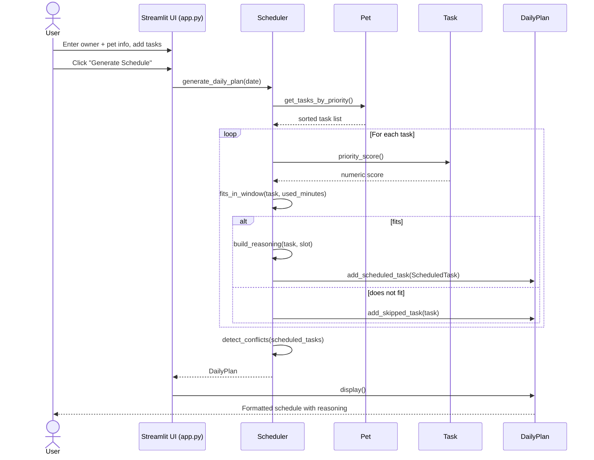
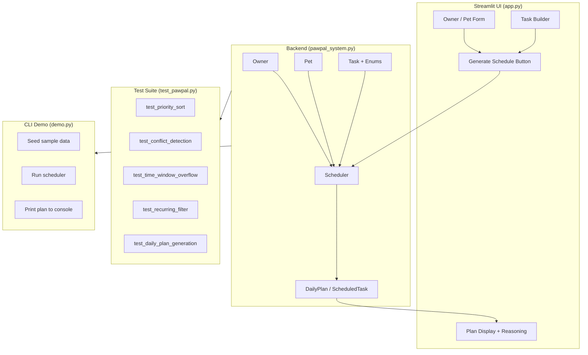

# PawPal+ — System Architecture (UML)

## Class Diagram

```mermaid
classDiagram
    %% ── Enumerations ──────────────────────────────────────────────────────────

    class Priority {
        <<enumeration>>
        LOW
        MEDIUM
        HIGH
        CRITICAL
    }

    class TaskCategory {
        <<enumeration>>
        WALK
        FEEDING
        MEDICATION
        GROOMING
        ENRICHMENT
        APPOINTMENT
        VET_CHECKUP
    }

    class RecurrencePattern {
        <<enumeration>>
        ONCE
        DAILY
        WEEKLY
        CUSTOM
    }

    class TaskStatus {
        <<enumeration>>
        PENDING
        SCHEDULED
        COMPLETED
        SKIPPED
    }

    %% ── Core Domain Classes ───────────────────────────────────────────────────

    class Owner {
        +String id
        +String name
        +String email
        +int available_minutes_per_day
        +List~String~ preferences
        +List~Pet~ pets
        +add_pet(pet: Pet) None
        +remove_pet(pet_id: String) bool
        +get_total_task_minutes() int
        +__repr__() String
    }

    class Pet {
        +String id
        +String name
        +String species
        +String breed
        +float age_years
        +float weight_kg
        +List~Task~ tasks
        +add_task(task: Task) None
        +remove_task(task_id: String) bool
        +get_tasks_by_priority() List~Task~
        +get_tasks_by_category(category: TaskCategory) List~Task~
        +get_total_duration() int
        +__repr__() String
    }

    class Task {
        +String id
        +String title
        +TaskCategory category
        +int duration_minutes
        +Priority priority
        +RecurrencePattern recurrence
        +TaskStatus status
        +String notes
        +String preferred_time_of_day
        +bool is_time_sensitive
        +mark_complete() None
        +mark_skipped() None
        +reset() None
        +priority_score() int
        +__repr__() String
    }

    %% ── Scheduling Classes ────────────────────────────────────────────────────

    class ScheduledTask {
        +Task task
        +String start_time
        +String end_time
        +String reasoning
        +to_dict() dict
    }

    class DailyPlan {
        +String date
        +Owner owner
        +Pet pet
        +List~ScheduledTask~ scheduled_tasks
        +List~Task~ skipped_tasks
        +int total_scheduled_minutes
        +int available_minutes
        +String plan_summary
        +add_scheduled_task(st: ScheduledTask) None
        +add_skipped_task(task: Task) None
        +get_utilization_pct() float
        +display() None
        +to_dict() dict
    }

    class Scheduler {
        +Owner owner
        +Pet pet
        +int day_start_hour
        +int day_end_hour
        +generate_daily_plan(date: String) DailyPlan
        +sort_tasks_by_priority(tasks: List~Task~) List~Task~
        +detect_conflicts(tasks: List~Task~) List~tuple~
        +fits_in_window(task: Task, used_minutes: int) bool
        +build_reasoning(task: Task, slot: String) String
        -_assign_time_slots(sorted_tasks: List~Task~) List~ScheduledTask~
        -_filter_recurring(tasks: List~Task~, date: String) List~Task~
    }

    %% ── Relationships ─────────────────────────────────────────────────────────

    Owner "1" o-- "0..*" Pet           : owns
    Pet   "1" o-- "0..*" Task          : has
    Task        ..>  Priority           : uses
    Task        ..>  TaskCategory       : uses
    Task        ..>  RecurrencePattern  : uses
    Task        ..>  TaskStatus         : uses
    ScheduledTask "1" *-- "1" Task     : wraps
    DailyPlan "1" *-- "0..*" ScheduledTask : contains
    DailyPlan       ..>  Owner          : references
    DailyPlan       ..>  Pet            : references
    Scheduler       ..>  Owner          : reads
    Scheduler       ..>  Pet            : reads
    Scheduler  ..>  DailyPlan          : produces
```

---

## Sequence Diagram — Generate Daily Plan

---

## Component Overview

---

## Design Decisions

| Decision | Rationale |
|---|---|
| `Priority` as enum with `priority_score()` | Makes sorting deterministic and easy to extend |
| `ScheduledTask` wraps `Task` | Separates mutable schedule state from task definition |
| `Scheduler` is stateless beyond owner/pet | Enables re-scheduling without side-effects |
| `DailyPlan` tracks both scheduled + skipped | Lets the UI explain *why* tasks were dropped |
| `available_minutes_per_day` on Owner | Central constraint used by `fits_in_window()` |
| `preferred_time_of_day` on Task | Soft constraint; scheduler respects it when possible |
