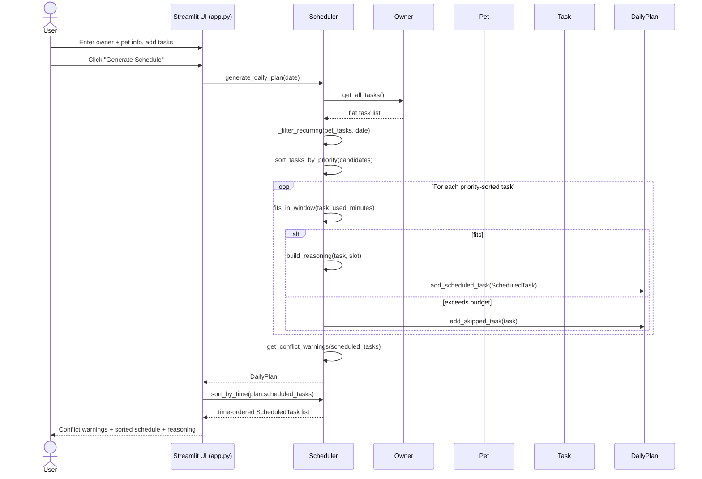

# PawPal+ — Final System Architecture (UML)

> Updated after Phase 6 to reflect the complete implementation in `pawpal_system.py`.

## Class Diagram

```mermaid
classDiagram
    %% ── Enumerations ──────────────────────────────────────────────────────────

    class Priority {
        <<enumeration>>
        LOW = 1
        MEDIUM = 2
        HIGH = 3
        CRITICAL = 4
    }

    class TaskCategory {
        <<enumeration>>
        WALK
        FEEDING
        MEDICATION
        GROOMING
        ENRICHMENT
        APPOINTMENT
        VET_CHECKUP
    }

    class RecurrencePattern {
        <<enumeration>>
        ONCE
        DAILY
        WEEKLY
        CUSTOM
    }

    class TaskStatus {
        <<enumeration>>
        PENDING
        SCHEDULED
        COMPLETED
        SKIPPED
    }

    %% ── Core Domain Classes ───────────────────────────────────────────────────

    class Owner {
        +String id
        +String name
        +String email
        +int available_minutes_per_day
        +List~String~ preferences
        +List~Pet~ pets
        +add_pet(pet: Pet) None
        +remove_pet(pet_id: String) bool
        +get_all_tasks() List~Task~
        +get_total_task_minutes() int
        +__repr__() String
    }

    class Pet {
        +String id
        +String name
        +String species
        +String breed
        +float age_years
        +float weight_kg
        +List~Task~ tasks
        +add_task(task: Task) None
        +remove_task(task_id: String) bool
        +get_tasks_by_priority() List~Task~
        +get_tasks_by_category(category: TaskCategory) List~Task~
        +mark_task_complete(task: Task, today: String) Task
        +get_total_duration() int
        +__repr__() String
    }

    class Task {
        +String id
        +String title
        +TaskCategory category
        +int duration_minutes
        +Priority priority
        +RecurrencePattern recurrence
        +TaskStatus status
        +String notes
        +String preferred_time_of_day
        +bool is_time_sensitive
        +Optional~String~ due_date
        +priority_score() int
        +mark_complete() None
        +mark_skipped() None
        +reset() None
        +next_occurrence(from_date: String) Optional~Task~
        +__repr__() String
    }

    %% ── Scheduling Classes ────────────────────────────────────────────────────

    class ScheduledTask {
        +Task task
        +String start_time
        +String end_time
        +String reasoning
        +to_dict() dict
    }

    class DailyPlan {
        +String date
        +Owner owner
        +Pet pet
        +List~ScheduledTask~ scheduled_tasks
        +List~Task~ skipped_tasks
        +int available_minutes
        +String plan_summary
        +total_scheduled_minutes: int
        +add_scheduled_task(st: ScheduledTask) None
        +add_skipped_task(task: Task) None
        +get_utilization_pct() float
        +display() None
        +to_dict() dict
    }

    class Scheduler {
        +Owner owner
        +Pet pet
        +int day_start_hour
        +int day_start_minute
        +int day_end_hour
        +generate_daily_plan(date: String) DailyPlan
        +sort_tasks_by_priority(tasks: List~Task~) List~Task~
        +sort_by_time(scheduled_tasks: List~ScheduledTask~) List~ScheduledTask~
        +detect_conflicts(scheduled: List~ScheduledTask~) List~Tuple~
        +get_conflict_warnings(scheduled: List~ScheduledTask~) List~String~
        +filter_by_status(tasks: List~Task~, status: TaskStatus) List~Task~
        +filter_by_pet(pet_name: String) List~Task~
        +fits_in_window(task: Task, used_minutes: int) bool
        +build_reasoning(task: Task, slot: String) String
        -_assign_time_slots(sorted_tasks: List~Task~) Tuple
        -_filter_recurring(tasks: List~Task~, date: String) List~Task~
        -_day_capacity() int
        -_minutes_to_hhmm(minutes: int) String
        -_hhmm_to_minutes(hhmm: String) int
        -_hour_to_period(hour: int) String
        -_build_summary(plan: DailyPlan) String
    }

    %% ── Relationships ─────────────────────────────────────────────────────────

    Owner "1" o-- "0..*" Pet           : owns
    Pet   "1" o-- "0..*" Task          : has
    Task        ..>  Priority           : uses
    Task        ..>  TaskCategory       : uses
    Task        ..>  RecurrencePattern  : uses
    Task        ..>  TaskStatus         : uses
    ScheduledTask "1" *-- "1" Task     : wraps
    DailyPlan "1" *-- "0..*" ScheduledTask : contains
    DailyPlan       ..>  Owner          : references
    DailyPlan       ..>  Pet            : references
    Scheduler       ..>  Owner          : reads
    Scheduler       ..>  Pet            : reads
    Scheduler  ..>  DailyPlan          : produces
```

---

## Changes from Initial Design

| Change | Reason |
|---|---|
| Added `Task.next_occurrence()` | Enables automatic recurrence — creates next-day/week Task copies |
| Added `Pet.mark_task_complete()` | Combines `mark_complete()` + recurrence spawning in one call |
| Added `Owner.get_all_tasks()` | Scheduler entry point — flat list across all pets |
| Added `Scheduler.sort_by_time()` | UI needs tasks displayed chronologically after priority sorting |
| Added `Scheduler.filter_by_status()` | Supports filtering COMPLETED / PENDING / SKIPPED views |
| Added `Scheduler.filter_by_pet()` | Enables cross-pet queries without exposing owner internals |
| Added `Scheduler.get_conflict_warnings()` | Wraps `detect_conflicts()` as human-readable strings for the UI |
| Added `Scheduler.day_start_minute` | Allows sub-hour start times (e.g. 7:30 AM) |
| Moved conflict display to top of plan | More useful to surface warnings before the schedule list |

---

## Sequence Diagram — Generate Daily Plan

